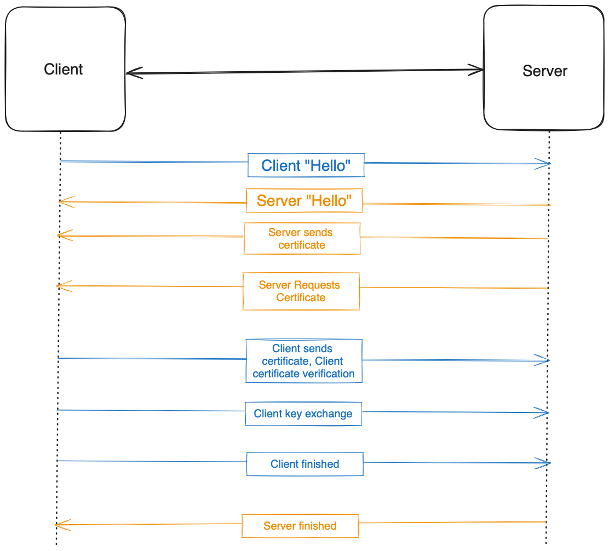

## How is mTLS different from what has been described in this lecture (securing websites)?

### TLS (for comparison)
- TLS was formerly called SSL
- The server has a certificate and public/private key pair and the client does not
- Certificates are presented by a trusted intermediary with certificates signed by a Certificate Authority

### mTLS
- Both client and server have certificates and key pairs
- mTLS involves several additional steps compares to TLS
	1. Client presents TLS certificate
	2. Server verified client certificate
	3. Server grants access
		[Source](https://www.cloudflare.com/en-gb/learning/access-management/what-is-mutual-tls/)
- Certificate authorities
	- The party implementing mTLS acts as its own certificate authority
	- They create and sign their own root certificate, which is used to authorise the organisation's own clients and servers
- Zero Trust Approach
	- Assumes that no connection should be trusted by default
	- "Least-privileged access" — Giving each party only as much access as they need
	- mTLS only establishes a connection if each party exchanges and verifies the other's certificate
		[Source](https://www.integrate.io/glossary/what-is-mtls/)

## Where is mTLS Frequently Used?
 - Devices on a corporate network
	 - The organisation can issue a certificate to a company device to authorise it on the local network
 - Smaller Organisations
	 - An organisation with lower network performance requirements may decide on a wider use of mTLS
 - Content Delivery Networks (CDNs)
	 - A CDN needs mutual authentication with the origin server to ensure there is no interception of data to or from the client.
 - "Internet of Things"
	 - Devices like refrigerators and traffic cameras 
 - B2B data exchanges using APIs
 - Microservices
	 [Source](https://www.f5.com/labs/learning-center/what-is-mtls)

## Give an example application that uses mTLS
Google Cloud Platform uses mTLS to secure connections between its services. [Source](https://www.bastionxp.com/mutual-tls/)

## Draw a diagram to show the process

